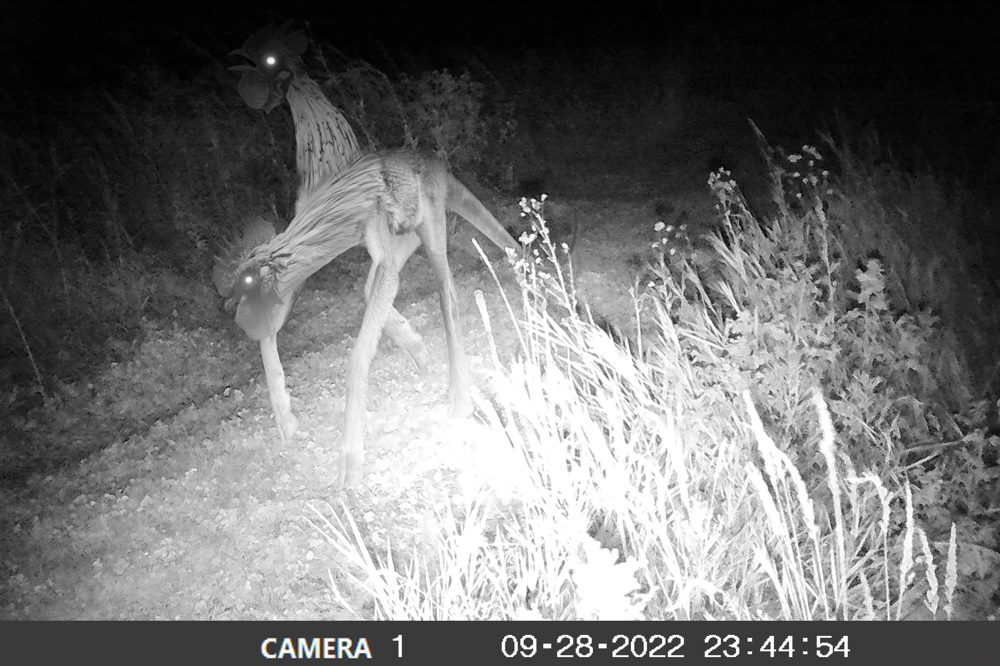
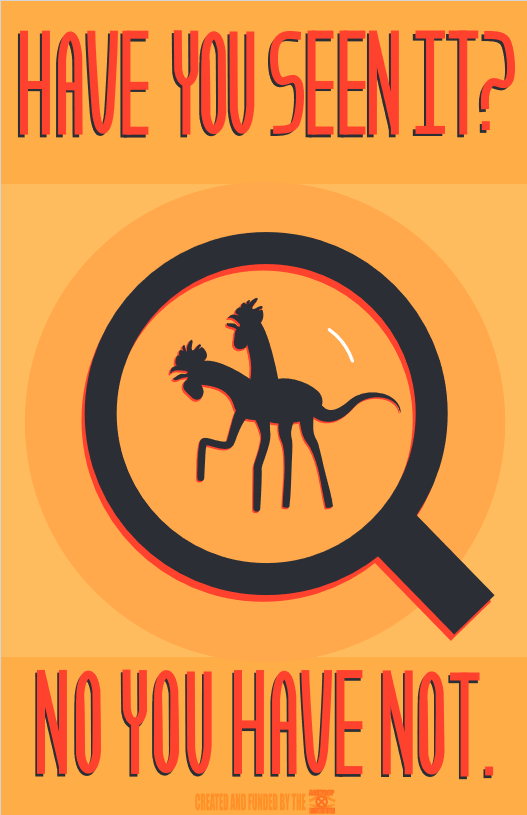
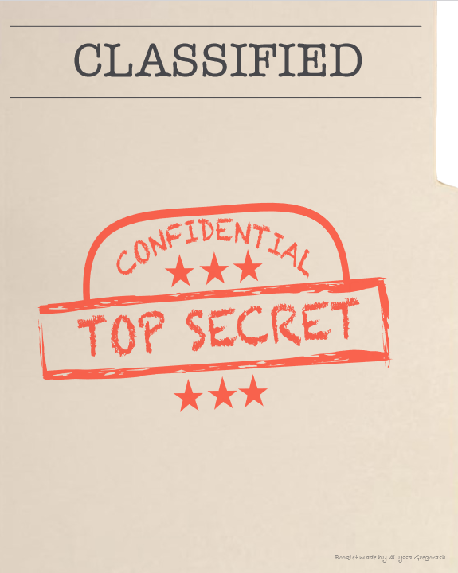
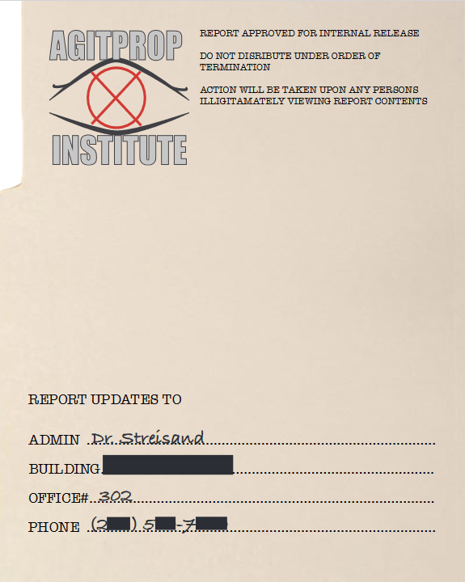
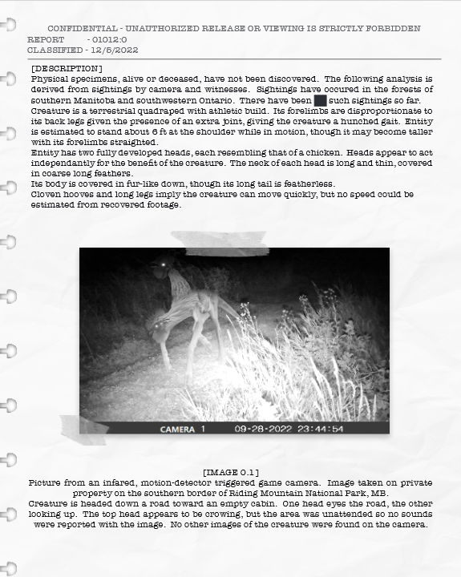
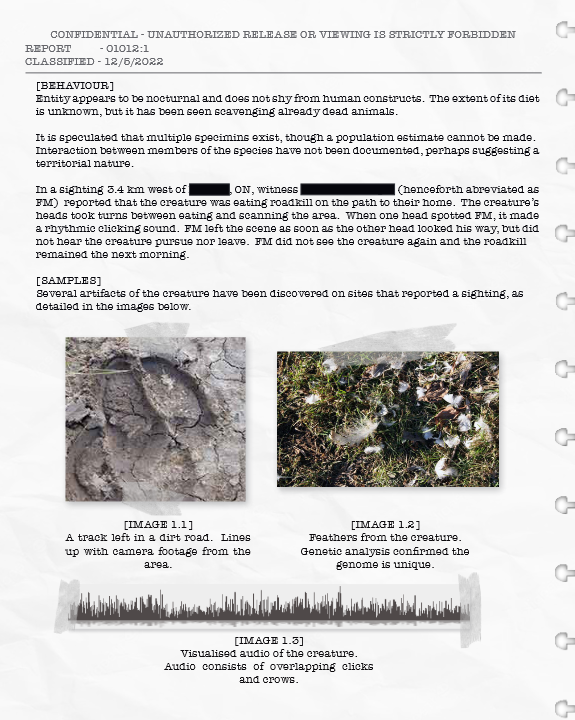
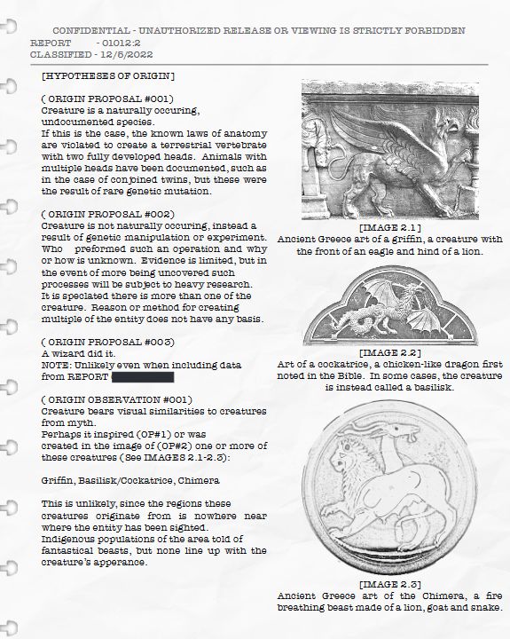
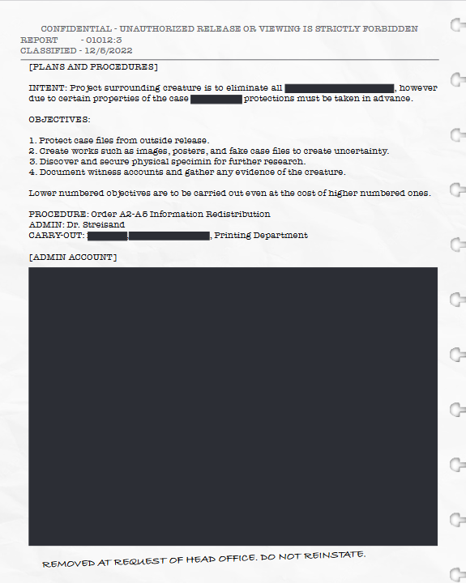
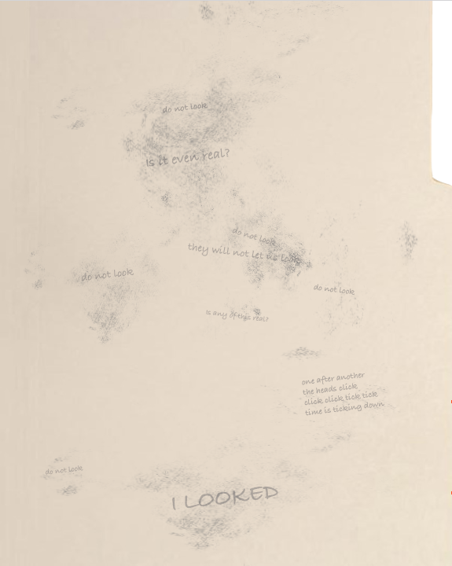
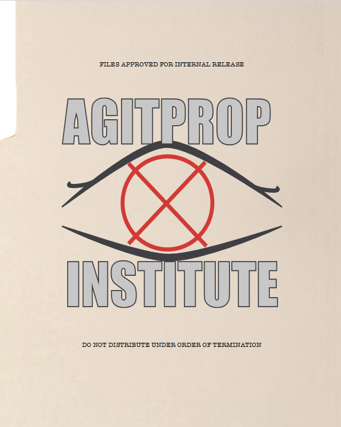

<h1 style="text-align: center;">
Cryptid Coverup
</h1>

<h3 style="text-align: center;">
These four works were created as part of a digital art course where we were free to choose our own idea.
Each piece centers around the plausable existance of an unknown creature similar in nature to bigfoot and other cryptids.
Later pieces introduce a mysterious organization who may be doing a purposefully bad job at covering up the creature's existence.

Click the 'about' section of each artwork to find out more!
</h3>

<h2 style="text-align: center;">
"Sighting"
</h2>

About this Piece

 
"Sighting" was created in Photoshop for a composite image assignment.

Using a base trail camera image, which I took from one of my grandparent's trail cameras, I added the creature on top of it.
The creature was created from images of a wolf, deer, rat, and two chickens.

When showing people this image, most did not notice the second head at first (it is less noticable on the printed version I have, admittedly).  I think this adds to the feeling that the more one looks at the creature, the more unsettling it is.

When I decided to create a cryptid for my project, I wanted to sell the eerie asthetic.  Game cameras at night are great for this!
They provide a snapshot of movement in the night when nobody is around, and with black-and-white lighting that makes anything freaky.
It also made it easier to convincingly edit together a creature, since I didn't have to worry about colour.

The camera provides and interesting angle for a light source, but it was not hard to shade the creature. The very subtle shadow of the beast is a concious choice,
since when I was looking at real trail cam footage I noticed that the animals on this camera tended to not have visible shadows.

The camera-with-timestamp asthetic sells that this is a real random occurance that maybe we were not meant to see.

When first conceptualizing the beast, I only knew I wanted it to have a chicken's head, uncanny leg joints, and a hunched posture.  After that, I discovered the creature as I created it.
 

<h2 style="text-align: center;">
"Have you seen it?"
</h2>

About this Piece

 
"Have you seen it?" was created in Illustrator for a vector art assignment.

The poster is paradoxical in that it uses bold colours to call attention to itself, despite that it is trying to cover something up.
The words assert that the viewer has not seen the creature, regardless of whether they have or not, with aim to make the viewer ask questions.

The style was inspired by old propoganda posters from the world wars, though this one was made to look sleek.

At the bottom the work is credited to the 'Agitprop Institute', a fictious group created for this project who seems to be trying to cover up the cryptid's existence,
but is doing so very poorly- perhaps on purpose.

'Agitprop' is an obscure word meaning 'disinformation' or 'propoganda'.

<h2 style="text-align: center;">
"The Files"
</h2>

---

Front Cover

 

Pages 1-2

 

Pages 3-4

 

Back Cover

 

---

About this Piece

 
"The Files" was created for an assignment to make an 8-page book in InDesign.  I decided to style the book as a file folder containing classified documents.

The focus for this project was on the aesthetic despite how many words there are.  The clinical writing style riddled with redactions was inspired by the SCP foundation's (an online writing community) articles.

'Dr.Streisand' on the inside of the front cover is named for the streisand effect, a phenomena where attempting to hide or censor information backfires and increases awareness of it instead.

An oddity presents itself on the last content page- the second objective is to create fake images, posters, and case files for the raw intent of creating disinformation.  This begs the question: are these the real files?  Is any of it real?

 

