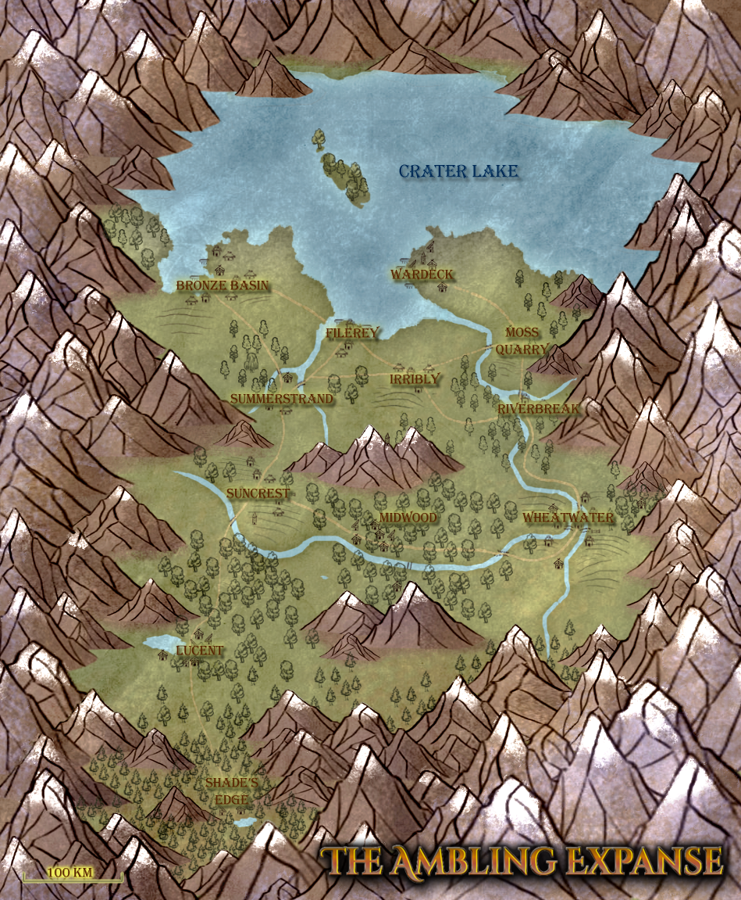
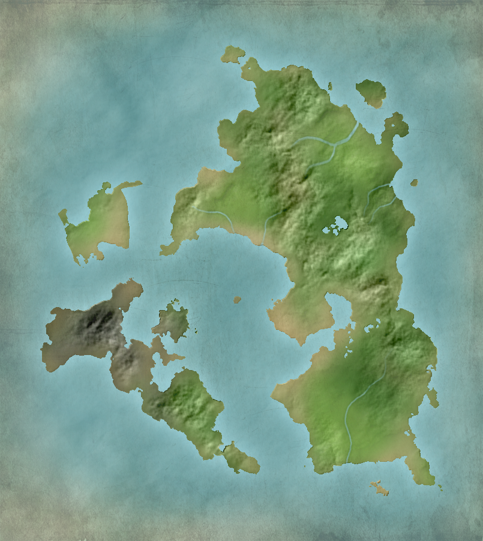
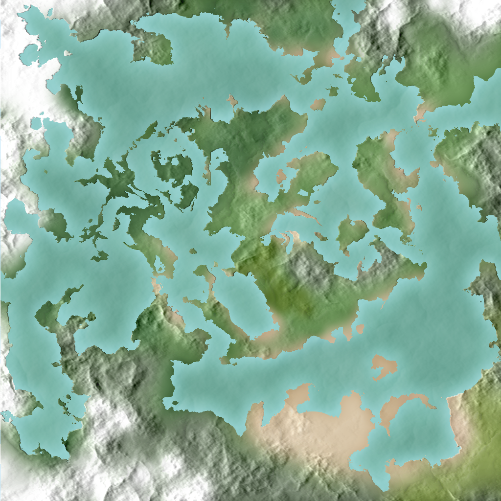
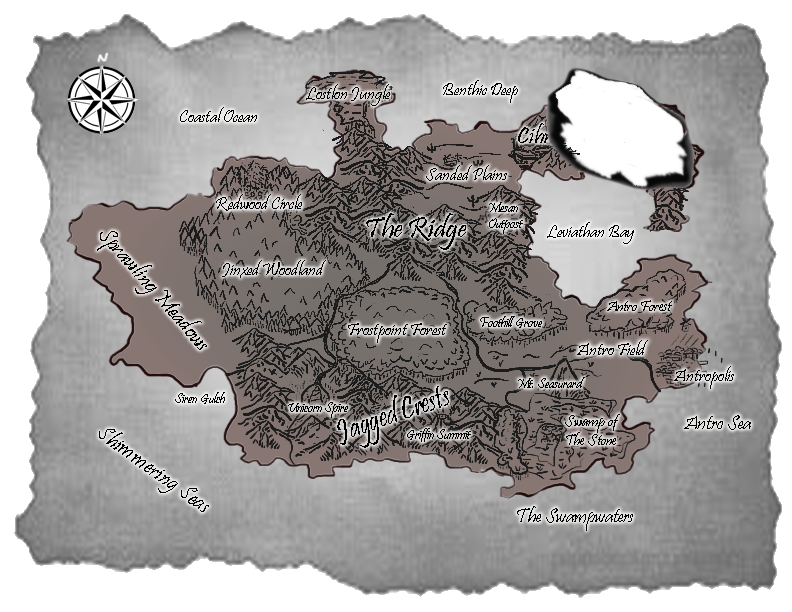
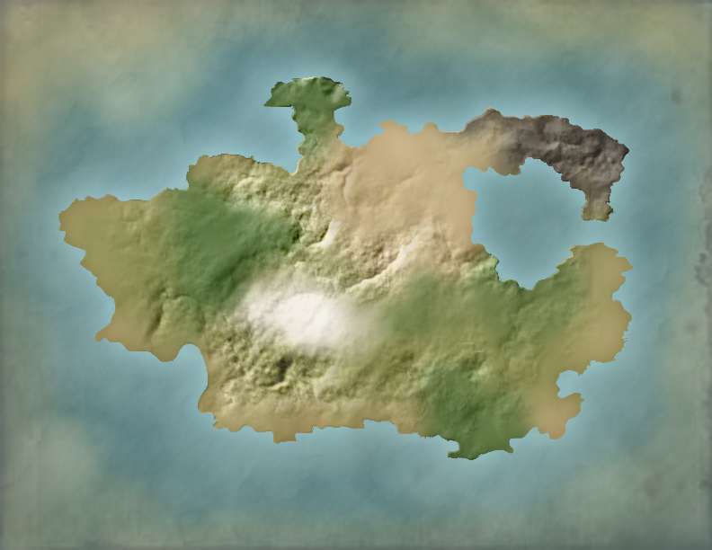

This is the map 'Across the Ambling Expanse' takes place on.

More information [here](./book_ambling.md).

What kid didn't try to make their own Pokemon region?

I made the map on the left in grade 10. The one on the right was an experiment, which was interesting but turned out unexciting.

