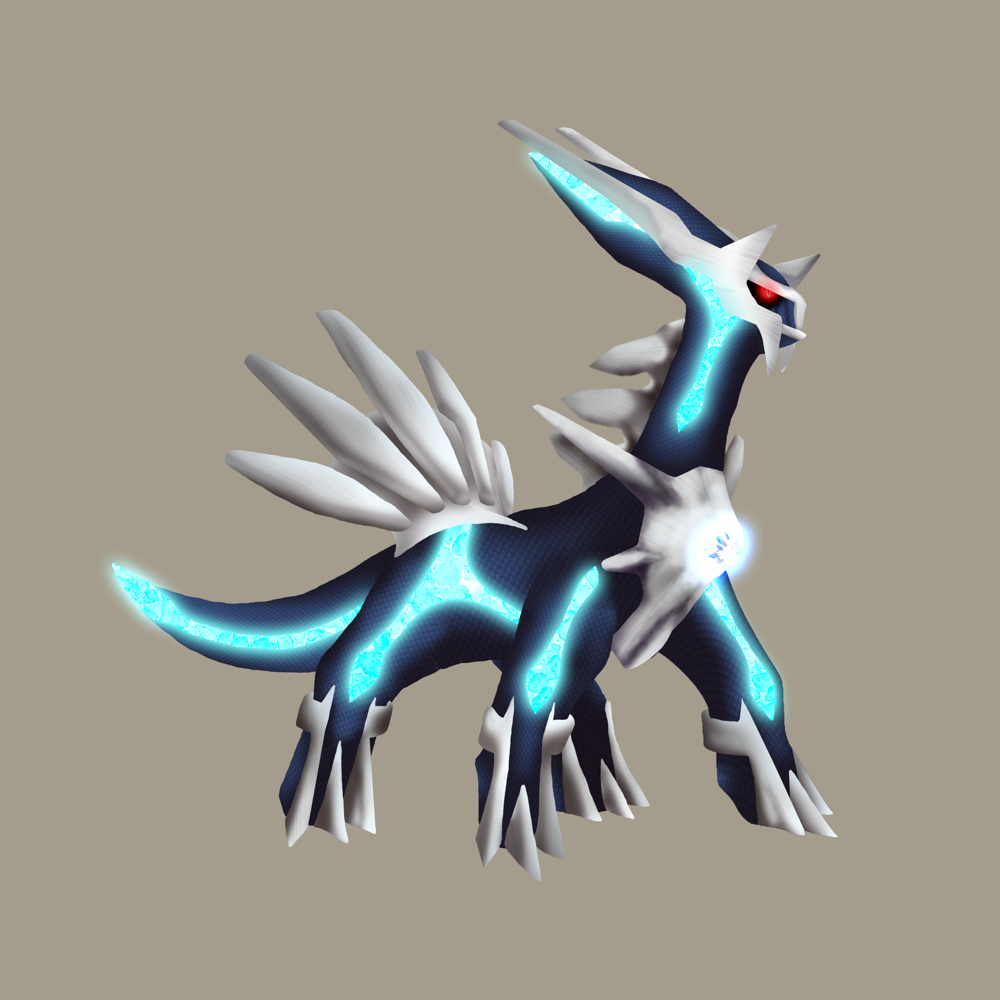
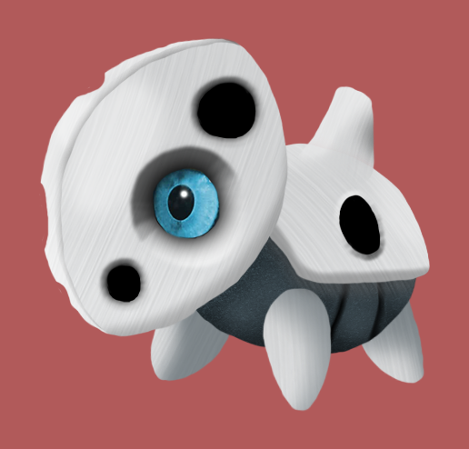
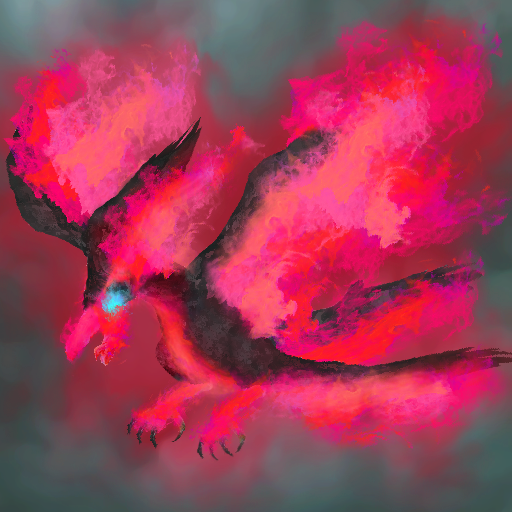
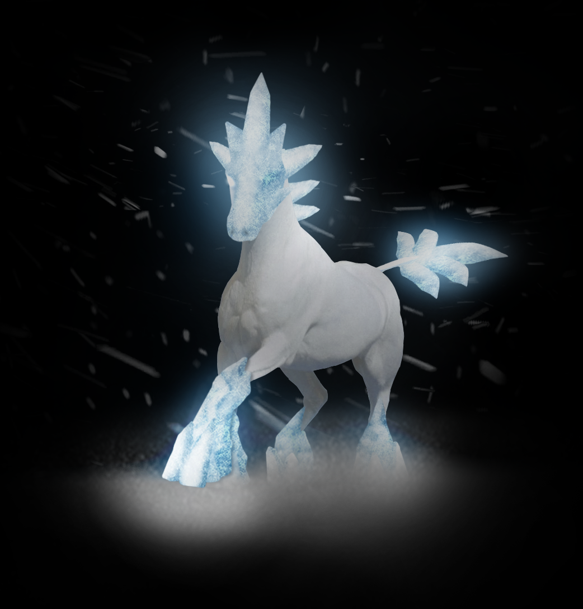
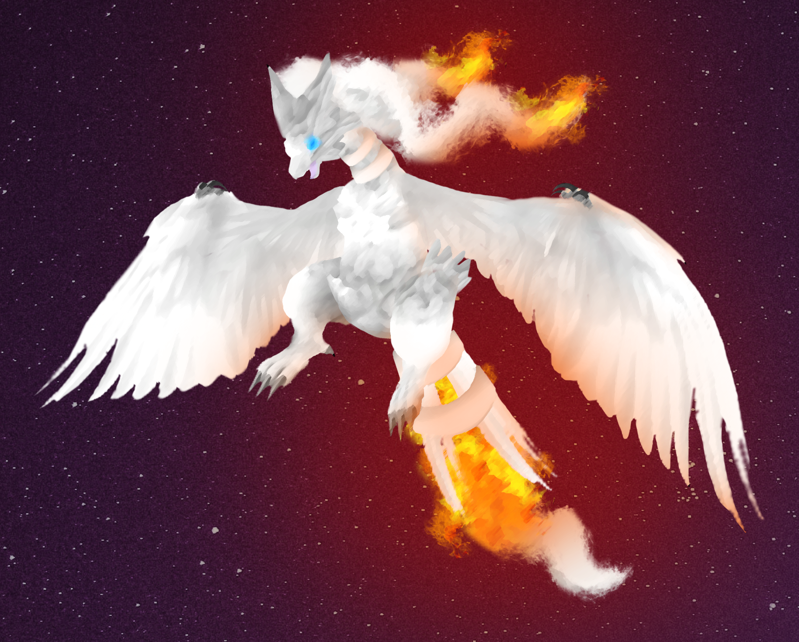
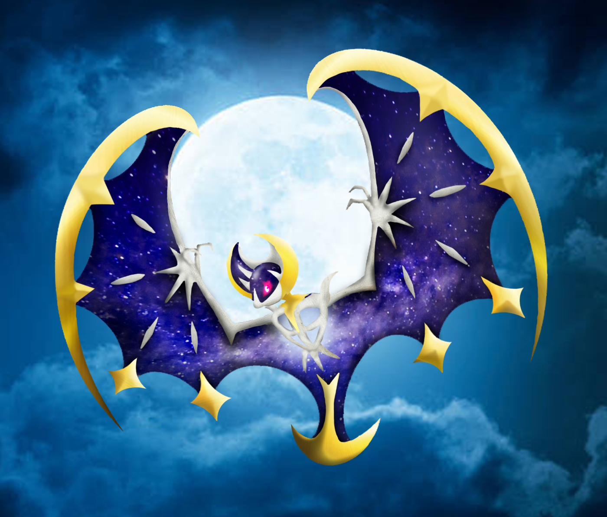

<h1 style="text-align: center;">
Pokemon, Realism-style
</h1>

I have not properly played a Pokemon game since 2017, but the elemental monsters still hold a special place
in my heart.  They also make for some easy and varied art ideas.  These images were inspired by those
"what if pokemon were real" images that have been circulating the internet forever.

Some are more stylized than others, but all aim to add a bit of detail to the normally cartoonish creatures.  All digital art.

