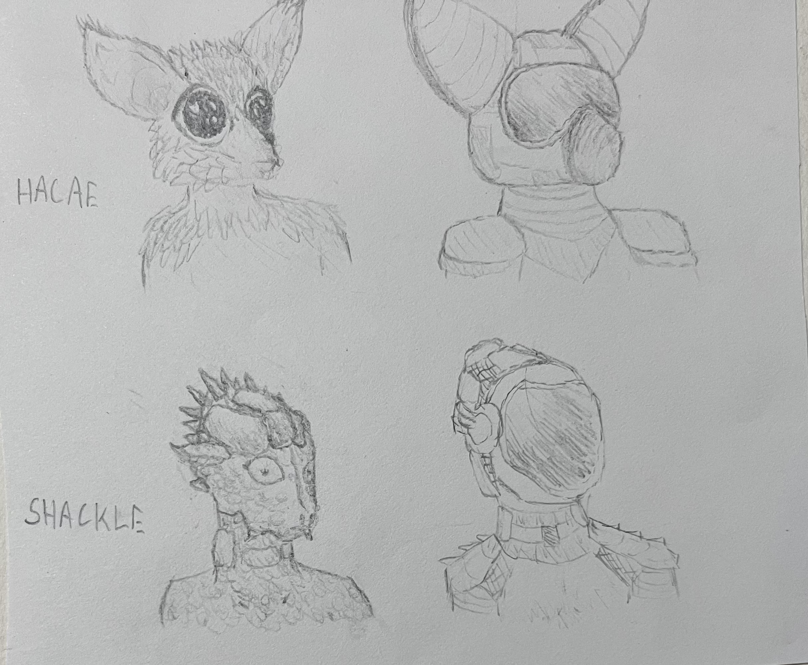
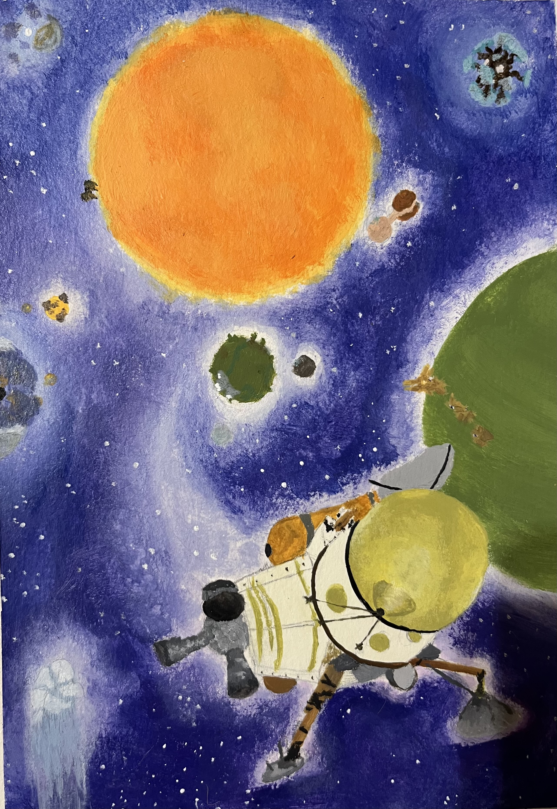
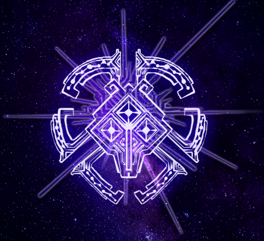
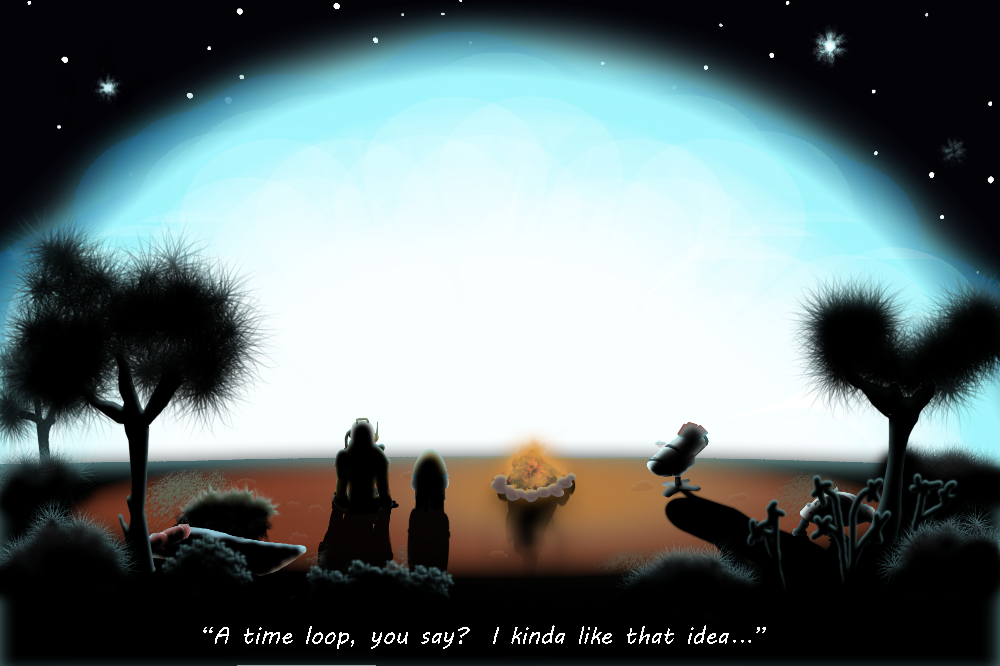
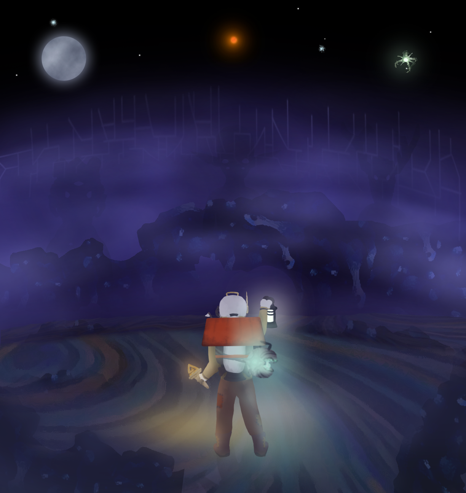
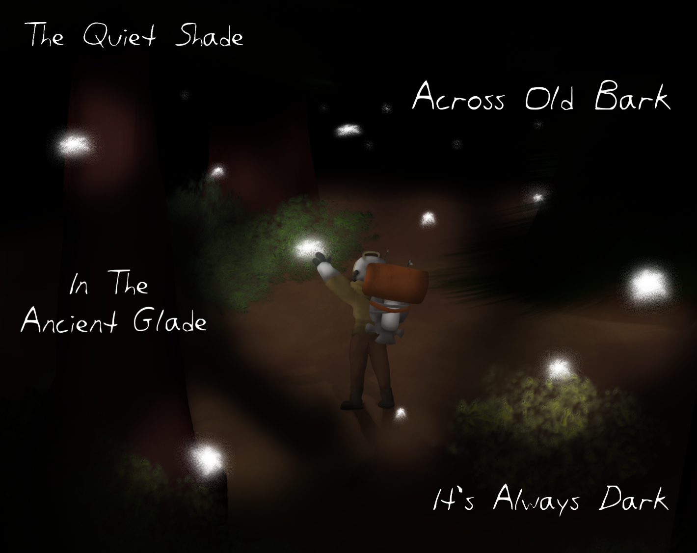
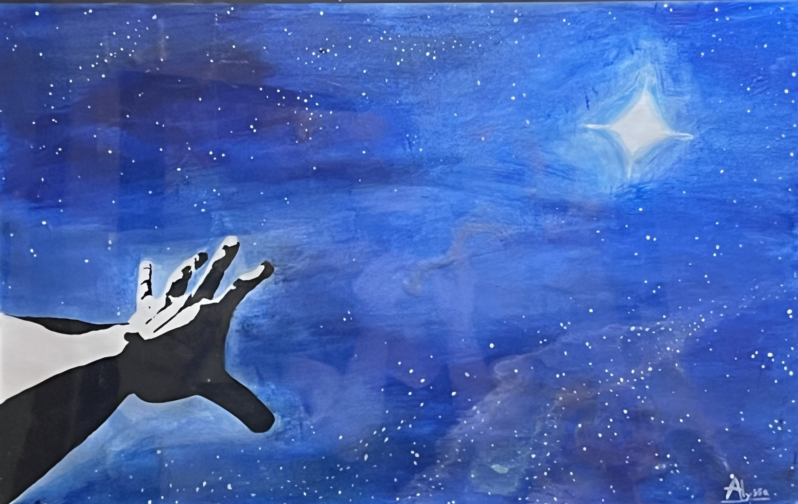
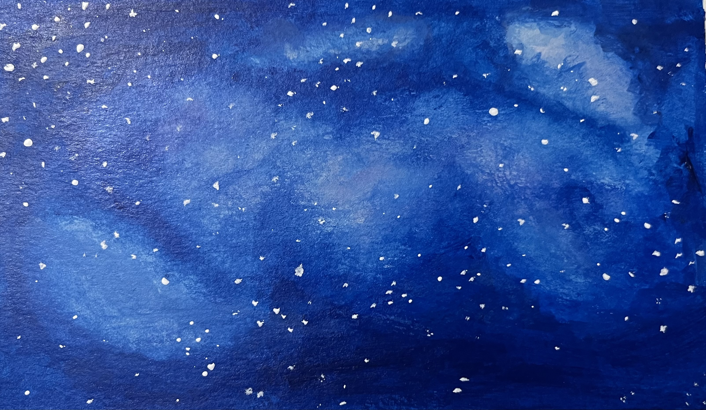
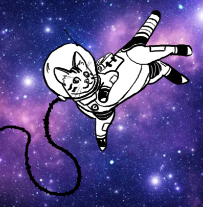
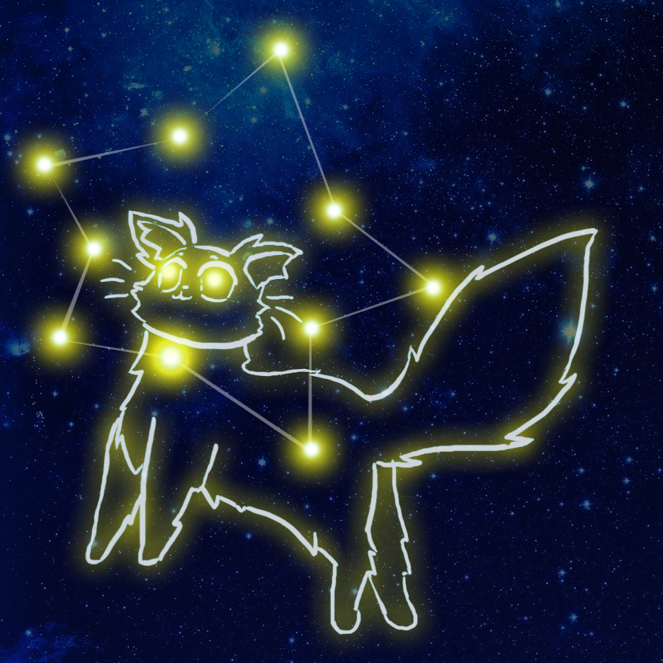

<h1 style="text-align: center;">
Space Themed Pieces
</h1>

<h3 style="text-align: center;">
Space is great for art.  It's stunning and provides a window into endless possibilities.
Plus, drawing astronauts means I don't have to draw human hands and faces.
</h3>

<h2>Collections</h2>

Welcome to Sector 423

 

I wrote some slice-of-life sci-fi back in grade 11. I love the world and characters, but the plot never found proper footing.

Medium: Digital

This cover was done as a class assignment.

Medium: Pencil

These concept images showed what space suits might look like for different creatures while still having a unifying asthetic.

Outer Wilds

 

My favourite video game is all about space and existentialism.

"Flyby" Medium: Acylic paint

"Observation" Medium: Digital Art

"Supernova" Medium: Digital Art

"Torchbearer" Medium: Digital Art

"The Glade" Medium: Digital Art

<h2>One-offs</h2>

"Reach" Medium: Acrylic Paint

Medium: Acrylic Paint

Medium: Acrylic Paint, Marker

"Astrocat" Medium: Digital Art

"Starcat" Medium: Digital Art

