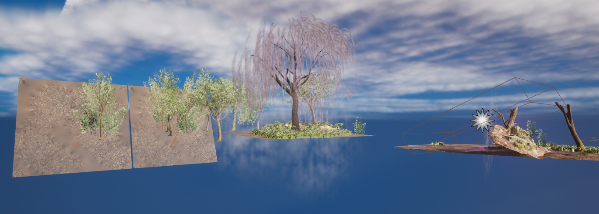
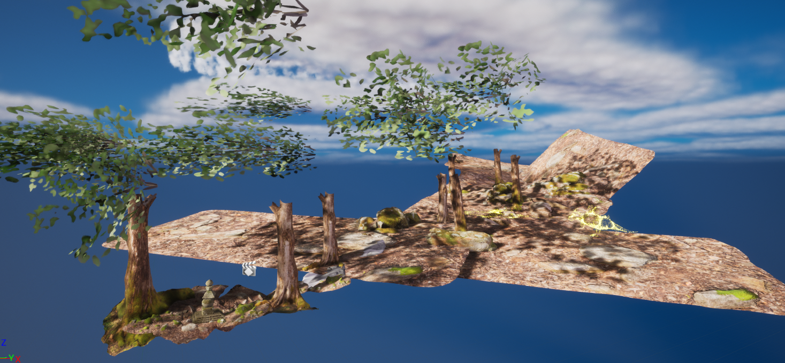
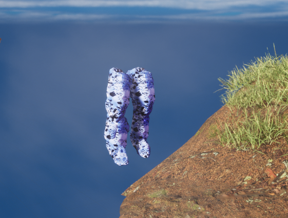

<h1 style="text-align: center;">
About the Trailer
</h1>

<h2>
Technical Details & Process
</h2>

I made this to experiment with Unreal Engine, which I had never used before.  It also seemed like a good excuse that would let me visibly 'explore' the world I'd created.
This video was created in Unreal Engine 5, using free assets (or 'free for the month' assets).

Every environment lies to the camera.  If the camera were moved even an inch up, it would be revealed that there is a twenty-meter blue void between each 'layer' of land.
This was done so that each piece of the environment was actually far away from each other so a nice depth-of-field could be achieved.

The trees in the forest are just trunks, and the shadows of leaves on the ground are created by floating bushes placed just above the screen.
Similarly, the trees in the final scene are not actually trees, but trunks with bushes floating meters in front of them.

The strange creatures in the first scene use the model and animations of some oddly shaped and scaled cartoon dragon models.  The sparkly apperance is a shader I created myself.
The aim for this was to find the weirdest shaped models I could so that the creatures do not resemble any known animal.
The goal was for the viewer to squint and guess at what they were looking at, rather than going "That's a sparkly fox."

One big question was whether to include characters, since there would be no real way to get models for them.  I did not want to settle for 'close enough' and though Unreal Engine provides 'Metahumans' for free, the clothing options are nonexistent.
So in the end only one character, the stone-fleshed monster hunter, got to appear.  Only her legs are shown, and that is all that actually exists.  The rock limbs were made by attaching retextured sodalite megascans to an invisible mannequin.

<h2>
What is happening?
</h2>

<h3>
General
</h3>

The first shots of the trailer are of the world itself, an ideallic valley covered in forest and farmland.  Somewhere in the forests is a figure with limbs made of stone who has finally found what she is looking for: a mystical tree.\
At the beginning of the novel, she has already found this tree and has moved onto the next stage of her plan, meaning this trailer provides a brief look into something that happened before the story.

<h3>
The Forest
</h3>

A shrine in the forest where unidentifiable creatures play.  These creatures are Earth Spirits, who believe these sorts of shrines bring safety.
  The spirits are elusive, and their energy is the source of the world's supernatural oddities.  These creatures are amorphus and often take shapes that crudely mimic animals.

<h3>
The Crows
</h3>

Several crows descend to investigate something shiny, a black feather that twinkles with false stars.  The feather is far too large to have come from any bird, begging the question of what left it behind.

<h3>
The Tower
</h3>

A tall tower from an age long gone stands as a monolith atop a hill.  This tower is how the story begins.

<h3>
The Tree
</h3>

A stone-fleshed individual moves through a lush forest, approaching a strange pink glow.  It is revealed that the source of the light is an otherworldly tree, which is the initial driver for the plot.

<h3>
Pathway
</h3>

Away from the mysteries this land holds is a mundane trail past an abandoned building, a common sight that sits on the surface of everything.

<h2>
Asset Credits, all sourced from the Unreal Marketplace
</h2>

Quixel Megascans

"ANIMAL VARIETY PACK" by PROTOFACTOR INC

"Animation Starter Pack" by Epic Games

"City Park Environment Collection LITE" by SilverTm

"Countryside: Windmills and Barns" by GeorgeShachnev

"Dragon for Boss Monster: Handpainted" by Dungeon Mason

"Landscape Backgrounds" by Gokhan Karadayi

"MCO Mocap Basics" by MoCap Online

"Particles and Wind Control System" by Dragon Motion

<h2>
Music Credits, sourced from Youtube
</h2>

"In Search of Solitude" by Scott Buckley