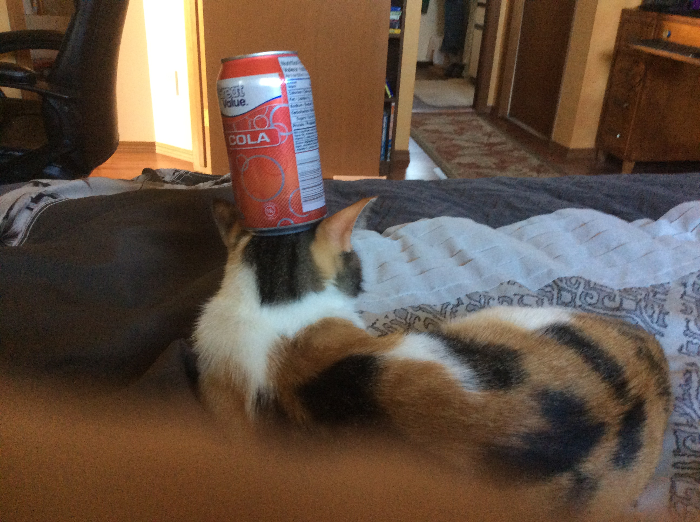

<h1 style="text-align: center;">
Cat Pictures
</h1>

<h3 style="text-align: center;">
My cat Autumn is pretty level headed.
</h3>

<h3 style="text-align: center;">
She also does this a lot. The shelter found her in a blizzard so we think she did this to conserve warmth.
</h3>

