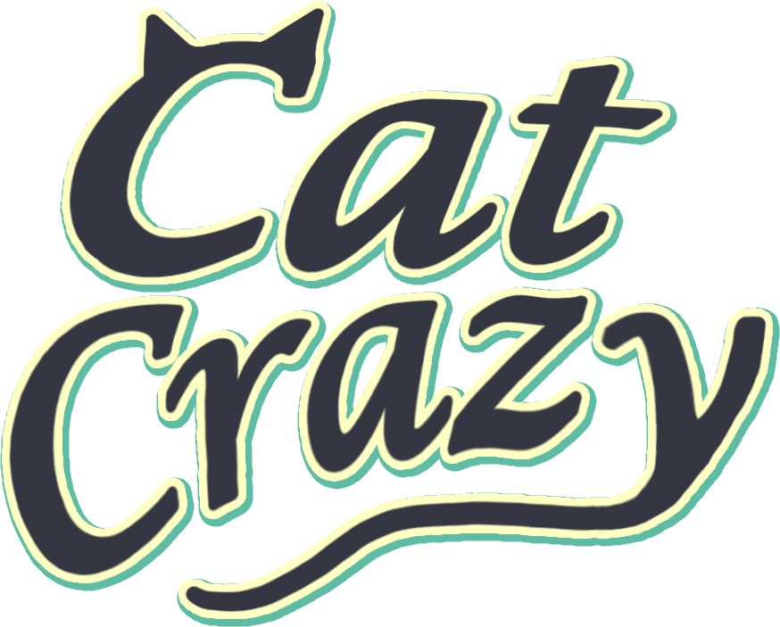
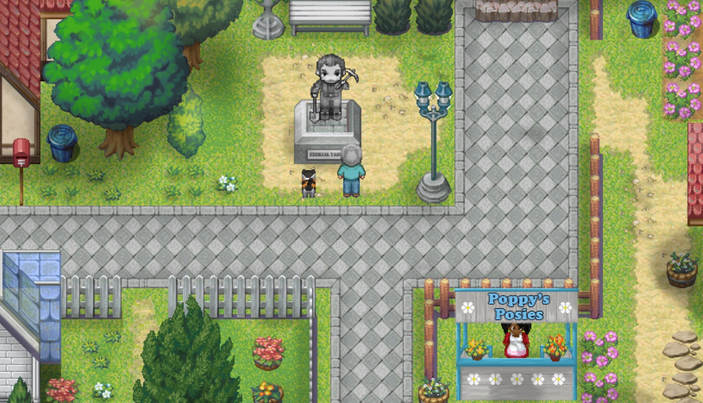
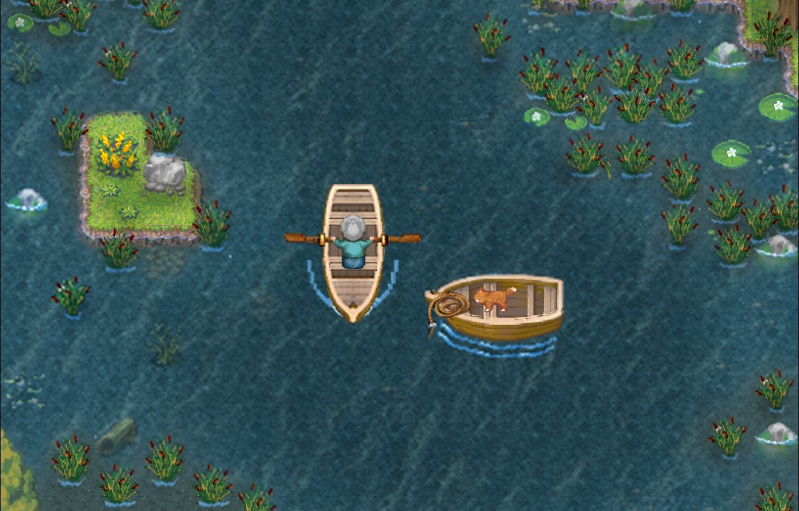
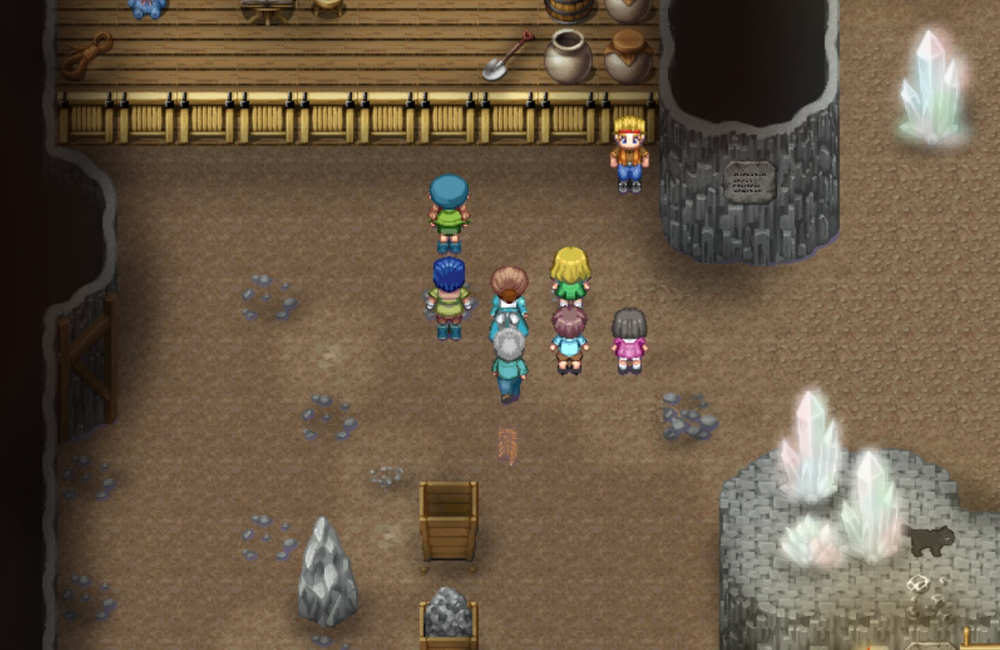
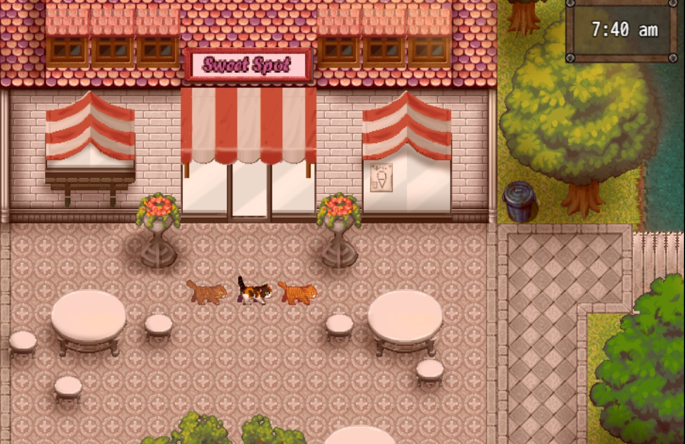

	

Cat Crazy is a Work-In-Progress cozy mystery!  Help cats and find clues to the elusive Treasure of Tabbietown.
Cats you befriend will help you in your quest to solve the town mystery!

The game is 100% feature-complete, with things like beautifying, playtesting, and bug-fixing ahead.

Cat Crazy was made in RPGMaker MV with many custom and modified assets.  RPGMaker MV is a javascript-based game engine.

	

I created this game along with my mom, who had no prior game dev experience.  We've come a long way, and I couldn't be prouder!

	

	

	

### Future Plans

If all goes well, Cat Crazy will be available on Steam sometime in the future.