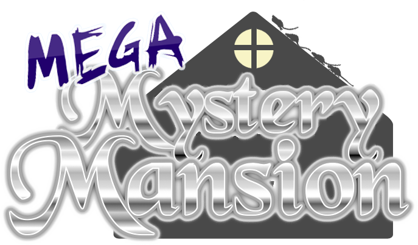
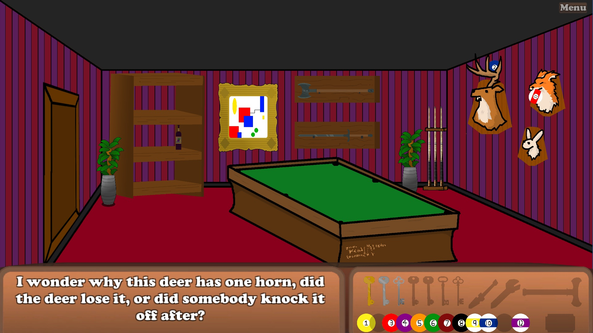
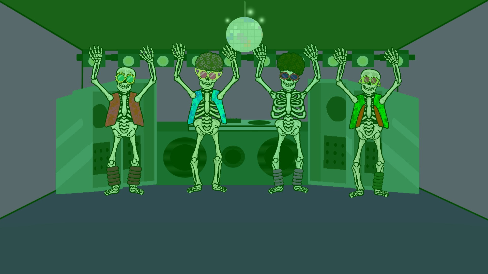
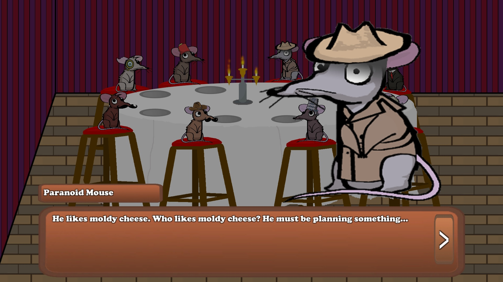

	

Mega Mystery Mansion is a game I made for a project in grade 12 with three of my friends.
It is a goofy point-and-click puzzle game set in a mansion containing talking rats, pool-playing ghosts, dancing skeletons, and more!

Mega Mystery Mansion was made in Unity 2D, using object-oriented C#.

	

I was the sole programmer, and this was my first time using Unity (or doing object-oriented programming, for that matter).
I also animated, organized the assets in the editor, and drew some of the characters like the mice and skeletons.

	

Partway into development, the COVID-19 pandemic hit and we had to take things online.  It was an adjustment for sure, but
it gave us more time to work on the project.

	

If I had one regret with how this was programmed, it would be not knowing how to make a loading screen
as the game looks like it crashes when hitting play before it loads.  There are other things wrong with it
certainly, since I had no experience in software design, but this is the most glaring to an end-user.
Despite that, this game will hold a special place in my heart and was an important step in my learning.

### Get the Game

Click [**here**](./downloads/Builds_Mansion.zip) to download the .zip of the game.

Once downloaded, extract the files.

Lauch the game using Mega Mystery Mansion.exe
