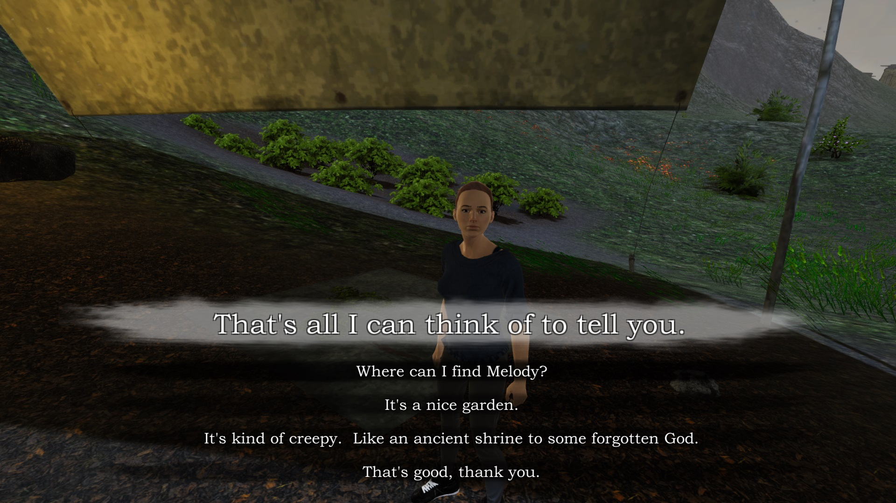

	

A Walk in the Rain was a solo practice project I made to learn about the Unity3D engine and how to finish a project.
This game was made during my first year of university, during the COVID-19 pandemic.

The game is a 'walking simulator' focused on a moral dilemma: the player must choose which of the island's inhabitants
will have a chance to escape the world-ending storm.

	

The gameplay is very barebones- you can walk around and talk to people. As you explore, you unlock more things
to talk about.

	

The aim of this project was to get a feel for how things get finished, built, optimized, etc.

Having minimal gameplay- and thus minimal oppurtunity for scope creep- was a goal from the beginning.

	

I believe this project gave me valuable insight into the planning and preparation for a larger project as well as the later parts of gamedev.

	

