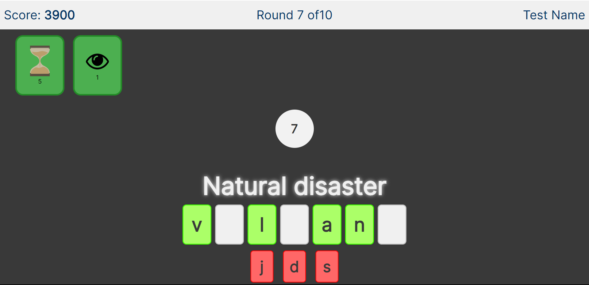
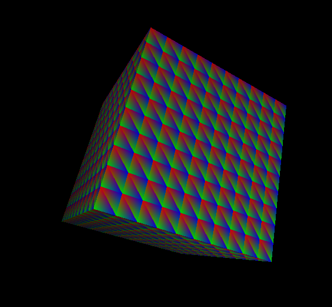
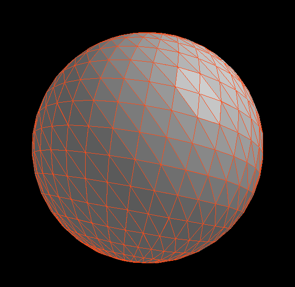
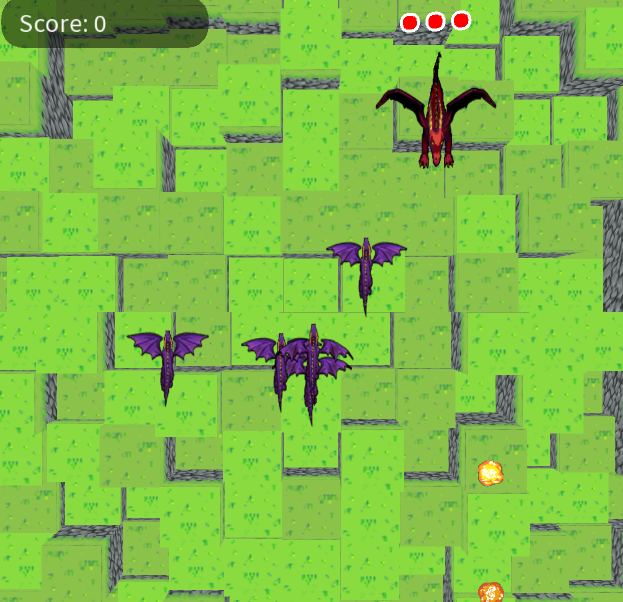

<h1 style="text-align: center;">
School Assignments
</h1>

<h3>
General
</h3>

Some smaller, less exciting but still learnable assignments can be found at a github [here](https://github.com/c4ke2/school-stuff).

<h3>
Wordeo
</h3>

Wordeo is a Wordle and hangman inspired browser-based word-guessing game with in-built competative elements.
It was made as a 4th year Software Engineering project with myself and four other people.
I mostly handled front-end things, as other people on the team had a stronger preferance for backend, while I could go either way.
I also made all diagrams needed for the assessment, including the Architecture and Sequence diagrams.

The project was recieved very positively by peers and professer alike.

Its source can be found at a github [here](https://github.com/hamdielzard/Wordeo).
I do not own this Github, so I apologize if the link stops working.

<h3>
Graphics Projects
</h3>

I took two years of Graphics and created a variety of projects in Processing (a visual oriented language based on Java)
and OpenGL with C++.

The final project in the second year a topic of our choice, and I choose to create a Shell-fur shader
as I found the technique an interesting approach to realtime fur.
The project can be found [**here**](./downloads/Shell-Build.zip) to download the .zip of the project.

Once downloaded, extract the files.

Launch the project by using the .exe

<h3>
Database Project
</h3>

Myself and two others created an SQL relational database with a Java interface for a project.
The data was about Pokemon, including the Pokemon, moves, types, items, evolutions, forms, and more.

I helped with everything except the Java interface, particularly with parsing the data into insert statements,
making documentation, and designing how the database would be structured.  There ended up being so much data
it needed to be split into 6 files to optimize initialization.

Here is a breakdown of the project:

<object data="./img/Database-Pokemon.pdf" type="application/pdf" style="min-height:100vh;width:100%">
    
Something went wrong and the PDF cannot be displayed.

</object>
 

<h3>
Recimeal
</h3>

Recimeal was an Android App created in Android Studio with four other people for a software engineering course.
Using the app a user could create, such, store, and favourite recipes.  The app worked like a digital cookbook.

I handled most of the front end and documentation, as well as helping on the backend where needed.  Most of the
team was oriented to the database and backend parts of the project.

Unfortunately the GitLab it was stored on is private, and the website for it is no longer active.